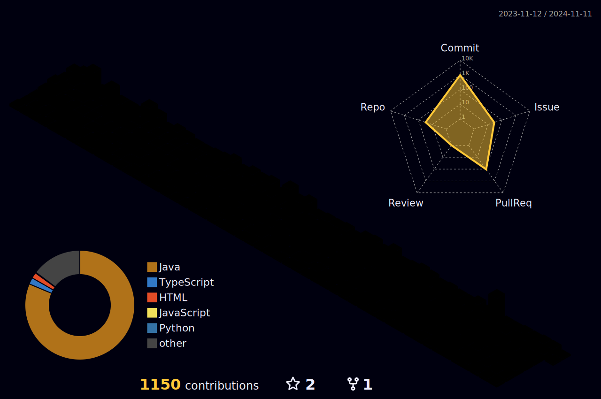
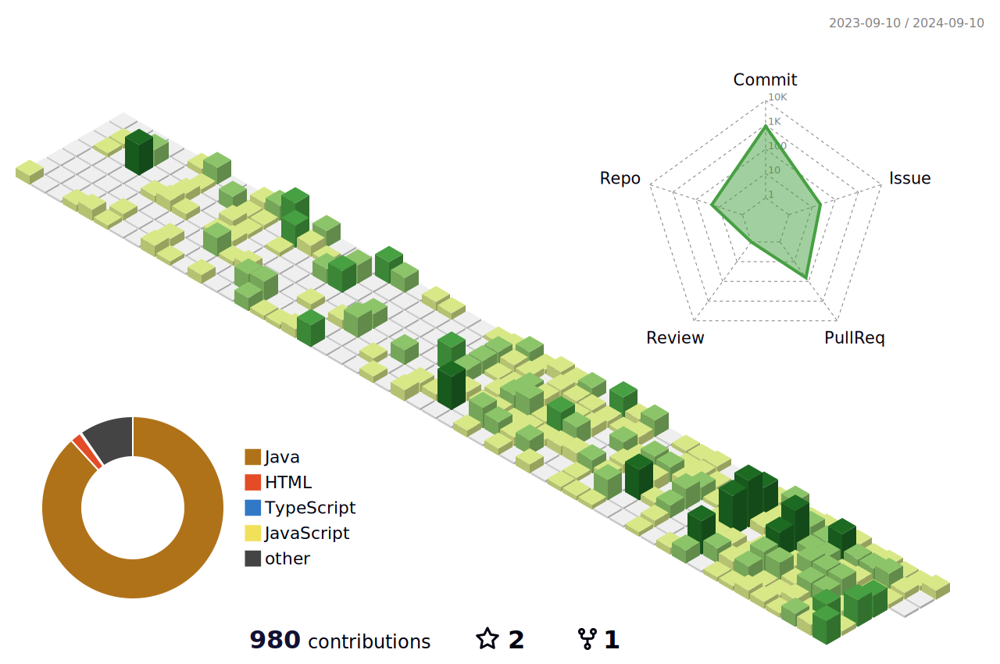
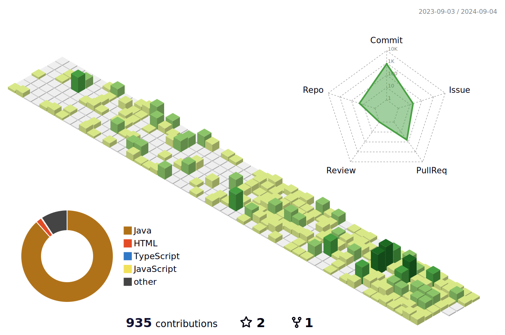
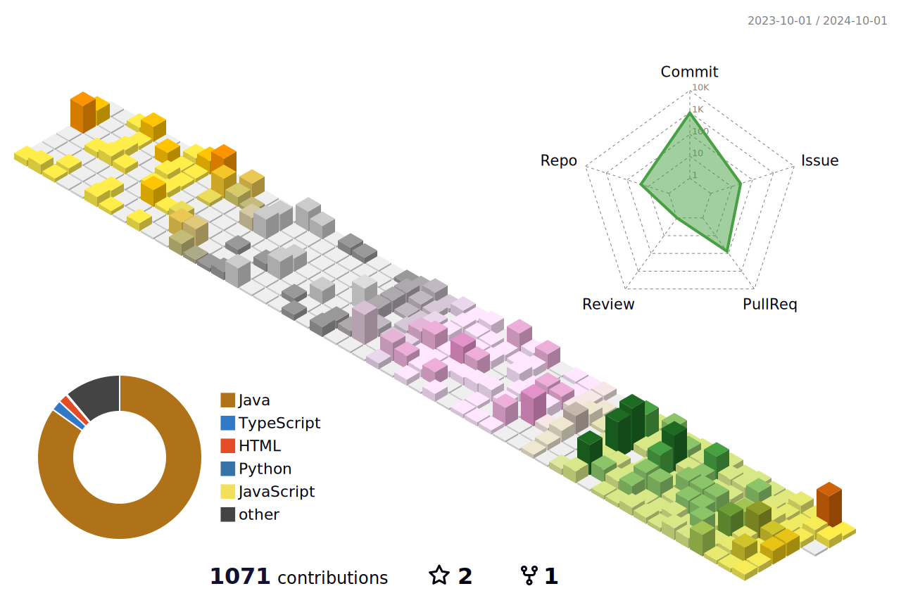
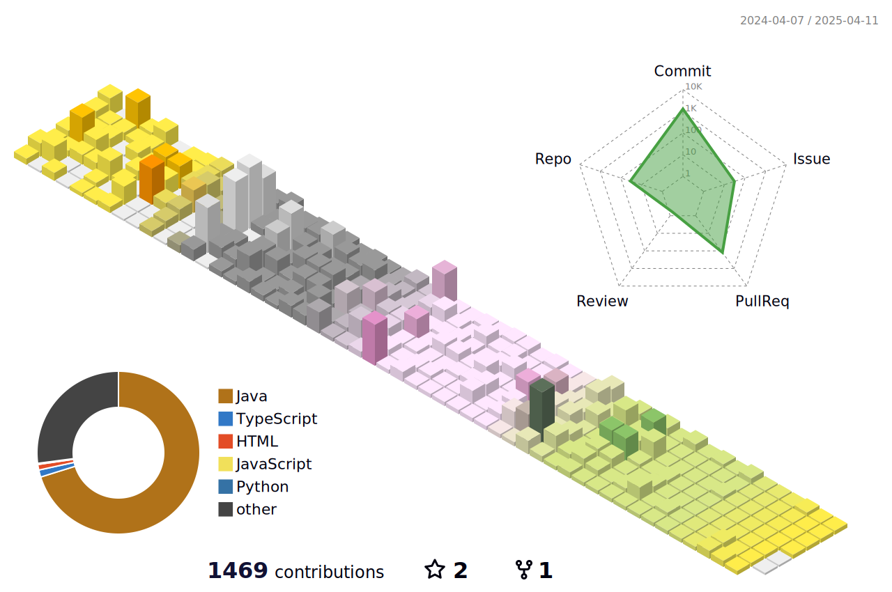
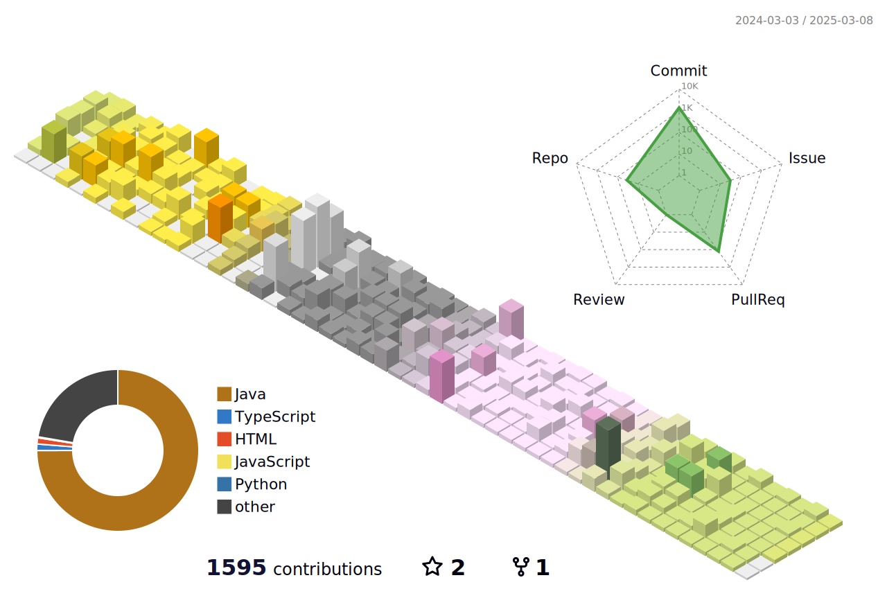
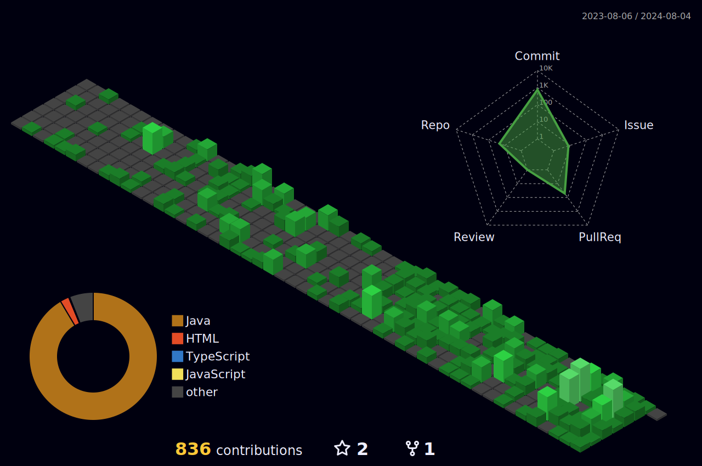

# Hello 

Here are some ideas to get you started:

  <em>
- 🌱 I’m learning <b>Spring boot</b>  
- 👯 I’m looking to collaborate on Web 
- 📫 How to reach me: hans9839@naver.com  or hanseu9839@gmail.com 
   </em>

<!-- 초록 모드 -->

<!-- 북반구 모드 -->

<!-- 남반구 모드 -->

<!-- 다크 모드 -->

<!-- 레고 모드 -->

